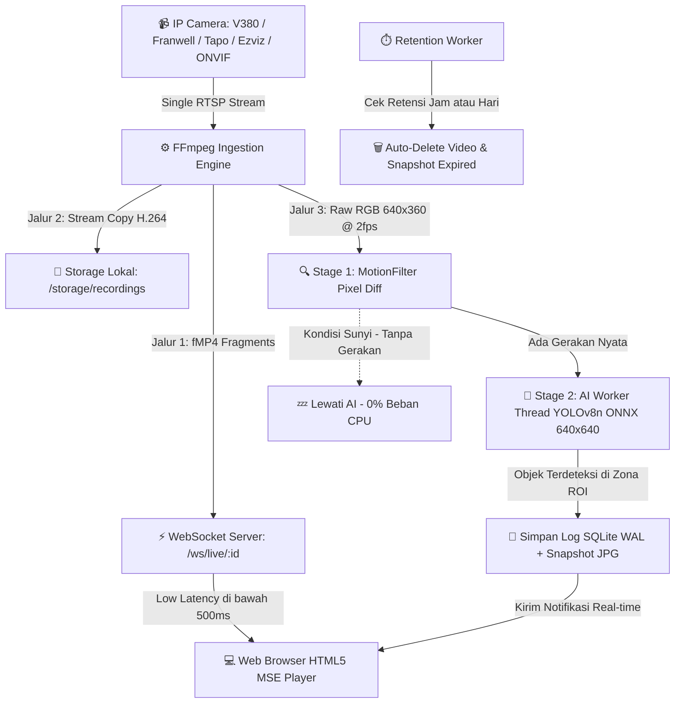

# 🛡️ NYX NVR (Antigravity Network Video Recorder)

<div align="center">


[](https://nodejs.org)
[](https://fastify.dev)
[](https://www.typescriptlang.org)
[](https://onnxruntime.ai)
[](https://github.com/jnckcode/NYXNVR)

**Next-Generation Edge CCTV & AI Surveillance Platform**  
*Platform perekam video CCTV pintar, super ringan, hemat daya, dan bebas biaya lisensi bulanan. Dirancang khusus untuk berjalan mulus di komputer Windows harian maupun perangkat edge murah seperti STB Android TV bekas (HG680-P / B860H RAM 2GB) bertenaga Armbian Linux.*

[Fitur Utama](#-fitur-utama) • [Detail Optimasi Performa](#-detail-rekayasa-optimasi-performa-low-spec--stb-ready) • [Dukungan Kamera CCTV](#-dukungan-perangkat-cctv--panduan-rtsp) • [Instalasi Windows](#-panduan-instalasi-windows-pemula-friendly) • [Instalasi Armbian / STB](#-panduan-instalasi-armbian--stb-hg680-p--b860h-pemula-friendly) • [API Docs](#-spesifikasi-rest-api--websocket)

</div>

---

## 📑 Daftar Isi
1. [Arsitektur & Keunggulan](#-arsitektur--keunggulan)
2. [Fitur Utama](#-fitur-utama)
3. [Detail Rekayasa Optimasi Performa (Low-Spec & STB Ready)](#-detail-rekayasa-optimasi-performa-low-spec--stb-ready)
4. [Dukungan Perangkat CCTV & Panduan RTSP](#-dukungan-perangkat-cctv--panduan-rtsp)
5. [Kebutuhan Sistem (Hardware & Software)](#-kebutuhan-sistem)
6. [Panduan Instalasi Windows (Pemula-Friendly)](#-panduan-instalasi-windows-pemula-friendly)
7. [Panduan Instalasi Armbian / STB HG680-P / B860H (Pemula-Friendly)](#-panduan-instalasi-armbian--stb-hg680-p--b860h-pemula-friendly)
8. [Pengelolaan Background Service (Jalan Otomatis Saat Boot)](#-pengelolaan-background-service)
9. [Fitur Cerdas: Deteksi Port Bentrok Otomatis](#-fitur-cerdas-deteksi-port-bentrok-otomatis)
10. [Mesin Auto-Delete & Retensi Penyimpanan](#-mesin-auto-delete--retensi-penyimpanan)
11. [Spesifikasi REST API & WebSocket](#-spesifikasi-rest-api--websocket)
12. [Cara Uninstall & Pembersihan](#-cara-uninstall--pembersihan)
13. [Pertanyaan Sering Diajukan (FAQ)](#-pertanyaan-sering-diajukan-faq)

---

## 🏗️ Arsitektur & Keunggulan

NVR tradisional sering membuat komputer atau STB hang karena mere-encode video berulang kali. **NYX NVR** menggunakan teknik **Single Ingestion**:

Setiap kamera RTSP hanya disedot **1 kali** oleh FFmpeg ke dalam memori, lalu dipecah langsung menjadi 3 jalur tanpa re-encoding (Direct Stream Copy):



---

## ⚡ Fitur Utama

- **🚀 HTML5 MSE Player Real-time (<500ms):** Nonton siaran langsung CCTV dari browser tanpa plugin, tanpa WebRTC yang rumit (tidak butuh STUN/TURN server), dan tanpa jeda HLS yang lambat.
- **🧠 Deteksi AI Dua Tahap (Two-Stage AI 640x360 Widescreen):**
  - **Tahap 1 (Motion Pre-filter 640x360):** Mendeteksi perubahan pixel pada frame raw RGB 640x360 (2 fps) dengan algoritma komputasi ringan berkecepatan tinggi. Jika kondisi ruangan sunyi, AI inference dilewati sehingga CPU tetap 0%.
  - **Tahap 2 (YOLOv8n ONNX Worker 640x640):** Begitu ada gerakan, frame 640x360 resolusi tajam langsung dialirkan ke worker thread YOLOv8n ONNX tanpa perlu decode ulang, mendeteksi manusia, kendaraan, hewan, dll. dengan akurasi tinggi bahkan untuk objek yang jauh.
  - **ROI Polygon Mask:** Atur area deteksi langsung di layar (misal: hanya pantau pintu gerbang, abaikan jalan raya umum).
- **🎛️ Dynamic Adaptive Load Governor (SBC & Potato Optimization):** Sistem cerdas yang memantau latensi AI dan otomatis mengadaptasi tingkat sampling komputasi (Tier: 🟢 *Performance*, 🟡 *Balanced*, 🔴 *Eco / Potato*) untuk mencegah *thermal throttling* pada STB ARM / Mini PC Celeron.
- **🎯 Dynamic AI Tuning & COCO 80 Class Filtering:** Slider interaktif untuk *Confidence Threshold* (10% - 95%) dan *IoU NMS Threshold* (10% - 90%) dengan preset sekali klik (🛡️ *Security*, 📱 *Smart Home*, 🌐 *All 80 Classes*).
- **🔌 Deteksi Port Bebas Otomatis (Auto-Port Detection):** Jika port `3000` sedang dipakai oleh aplikasi lain, NYX NVR otomatis mencari dan menggunakan port kosong berikutnya (`3001`, `3002`, dst.) tanpa error atau crash.
- **⏱️ Auto-Delete Rekaman Berdasarkan Waktu:** 
  - Tentukan lama penyimpanan dalam **Jam** atau **Hari** (misal: 6 jam, 24 jam, 3 hari, 7 hari, 14 hari, 30 hari).
  - Opsi otomatis membersihkan file foto snapshot AI (`.jpg`) dan log riwayat lama.
  - Tombol **"Purge Expired Now"** untuk menghapus rekaman basi secara instan.
  - Proteksi darurat ambang disk (otomatis menghapus rekaman tertua jika disk mencapai 90%).
- **🎨 Tampilan Industrial Brutalist:** Tema gelap bertema hazard amber yang elegan, hemat daya layar, responsif di HP/Tablet/Komputer, dengan grid fleksibel (1x1, 2x2, 3x3, 4x4) dan mode fokus kamera tunggal.
- **📡 Auto-Discovery Kamera:** Pindai jaringan Wi-Fi/LAN lokal otomatis untuk mendeteksi kamera ONVIF & SSDP dalam 1 klik.

---

## 🏎️ Detail Rekayasa Optimasi Performa (Low-Spec & STB Ready)

NYX NVR dirancang secara khusus untuk berjalan stabil 24/7 di perangkat hemat daya (seperti STB HG680-P / B860H Quad-Core ARM Cortex-A53 RAM 2GB) tanpa *overheating* dan tanpa *memory leak*. Berikut rincian rekayasa optimasi yang diterapkan:

### 1. 🟢 Adaptive Load Governor (`src/core/LoadGovernor.ts`)
Sistem secara *real-time* menghitung *rolling average* durasi inferensi AI dan responsivitas event loop Node.js untuk mengatur beban operasional ke dalam 3 tier adaptif:

| Tier Operasional | Kondisi Latensi | Sampling Rate AI | Interval Heartbeat | Strategi Throttling |
|---|---|---|---|---|
| 🟢 **PERFORMANCE** | $< 120\text{ ms}$ | **2.0 FPS** | $1000\text{ ms}$ | Full burst mode, latency prioritas tinggi |
| 🟡 **BALANCED** | $120 - 250\text{ ms}$ | **1.5 FPS** | $1500\text{ ms}$ | Dynamic pacing, keseimbangan CPU & FPS |
| 🔴 **ECO / POTATO** | $> 250\text{ ms}$ | **1.0 FPS** | $2500\text{ ms}$ | Cooldown diperpanjang, proteksi over-temperature |

> *Dilengkapi dengan **Hysteresis Hold-Time** (5 detik) untuk mencegah osilasi/flapping antar-tier saat terjadi lonjakan komputasi sesaat.*

### 2. ⚡ Conditional Decoding & Pure Remux Passthrough
- **Zero Re-encoding Ingestion:** Jalur perekaman ke disk dan pengaliran live ke WebSocket 100% menggunakan flag `-c:v copy` (tanpa encode/decode CPU).
- **Conditional Motion Pipe:** Jalur ekstraksi frame video decoding FFmpeg (`-vf fps=2,scale=160:120 pipe:3`) **hanya diaktifkan jika saklar AI kamera bernilai ON (`ai_enabled = 1`)**. Jika AI mati, kamera murni berjalan dalam mode passthrough murni dengan konsumsi CPU **$< 0.5\%$**.

### 3. 🌐 Anti-Stutter MSE Player & Smooth Micro-Rate Sync
- **Bukan Hard Seeking:** Pemutar video browser menghindari *hard seek jump* (`currentTime = end - 0.2`) yang sering merusak buffer GOP dan menyebabkan video macet setiap 2 detik.
- **Dynamic Micro-Rate Sync:** Player mempercepat pemutaran secara mikro (`playbackRate = 1.08x`) jika keterlambatan buffer $> 2.0$ detik, dan kembali ke `1.0x` begitu latensi turun ke $< 0.6$ detik. Hasilnya: siaran langsung tetap *real-time*, mulus, dan bebas jeda (*zero stuttering*).
- **Clean Lifecycle & Memory Revocation:** Saat berpindah tab navigasi, instance MSE dan WebSocket di-*teardown* secara bersih dan Blob Object URL dicabut (`URL.revokeObjectURL`) untuk mencegah akumulasi memori browser.

### 4. 💾 SQLite WAL Engine & Metadata Deduplication
- **Write-Ahead Logging (`WAL`):** Operasi penulisan log event dan segmen video tidak pernah mengunci (*lock*) operasi pembacaan dashboard.
- **Zero-Sweep Indexing:** Metadata segmen video diekstrak langsung dari log stderr FFmpeg saat file selesai ditulis, tanpa melakukan pemindaian direktori disk (*directory sweep*) berulang yang memicu lonjakan I/O harddisk.
- **Unique Constraint Indexing:** Indeks unik `idx_recordings_filepath` memastikan integritas database tanpa baris duplikat.

### 5. 🛡️ Resilient Reconnection Backoff
- Kamera offline atau jaringan terputus ditangani dengan **Exponential Backoff** ($3\text{s} \to 6\text{s} \to 11\text{s} \to 20\text{s} \to 35\text{s} \to \max 60\text{s}$) dengan batas waktu socket probe ketat (2s analyze / 5s timeout) agar koneksi yang putus tidak menimbulkan lonjakan 100% CPU.

---

## 📹 Dukungan Perangkat CCTV & Panduan RTSP

NYX NVR mendukung **SEMUA MERK KAMERA IP & CCTV** di pasaran yang memiliki fitur **RTSP** (*Real-Time Streaming Protocol*) atau **ONVIF** standar industri. 

Berikut panduan format URL RTSP untuk merk-merk CCTV populer:

### 📑 Cheat Sheet URL RTSP Kamera Populer

| Merk CCTV | Format URL RTSP Standar | Catatan & Tips Konfigurasi |
|---|---|---|
| **V380 / V380 Pro** | `rtsp://admin:password@<IP_CCTV>:554/live/ch0` <br>atau port `8554` | Pada beberapa model V380, fitur RTSP harus diaktifkan melalui aplikasi V380 Pro di menu *Network Settings* atau menggunakan firmware RTSP. |
| **Franwell / Bardi / Tuya / Smart Life** | `rtsp://admin:password@<IP_CCTV>:554/live/ch0` <br>atau `rtsp://<IP_CCTV>:8554/live/ch0` | Pada aplikasi Smart Life / Tuya, aktifkan fitur *PC View / ONVIF* pada pengaturan kamera untuk membuat username & password RTSP. |
| **TP-Link Tapo** (C200, C310, TC70, dll.) | `rtsp://username:password@<IP_CCTV>:554/stream1` | Buat akun kamera di aplikasi Tapo: *Settings* -> *Advanced Settings* -> *Camera Account*. Gunakan `stream1` (HD) atau `stream2` (SD). |
| **Ezviz & Hikvision** | `rtsp://admin:VERIFIKASI@<IP_CCTV>:554/H.264/ch1/main/av_stream` | Password bawaan Ezviz adalah **Kode Verifikasi 6 huruf kapital** yang tertera di stiker fisik bawah kamera. |
| **Dahua & Imou** (Ranger, Cue, Bullet) | `rtsp://admin:SAFETY_CODE@<IP_CCTV>:554/cam/realmonitor?channel=1&subtype=0` | Password default Imou adalah **Safety Code** pada label stiker kamera. `subtype=0` untuk Main Stream, `subtype=1` untuk Sub Stream. |
| **Xiaomi / Yi Home** | `rtsp://<IP_CCTV>:554/ch0_0.h264` | Memerlukan firmware modifikasi open-source (*Yi-Hack* / *Xiaomi-Hack*) agar port RTSP terbuka. |
| **DVR / NVR Standalone** (Generic H.264) | `rtsp://admin:password@<IP_DVR>:554/h264/ch1/main/av_stream` | Ganti `ch1` sesuai nomor channel kamera yang ingin ditarik. |

> 💡 **TIPS MENGETAHUI IP ADDRESS KAMERA CCTV ANDA:**
> 1. Buka dashboard modem/router Wi-Fi Anda (biasanya `192.168.1.1` atau `192.168.0.1`), lalu cek menu **DHCP Client List**.
> 2. Atau gunakan aplikasi HP gratis seperti **Fing** (Android/iOS) untuk memindai perangkat yang terhubung di jaringan Wi-Fi Anda.
> 3. Coba tes URL RTSP terlebih dahulu di software **VLC Media Player** di komputer: Buka menu *Media* -> *Open Network Stream* -> Tempel URL RTSP Anda. Jika video tampil lancar di VLC, berarti URL tersebut 100% siap dipakai di NYX NVR!

---

## 💻 Kebutuhan Sistem

| Komponen | Spesifikasi Minimum | Rekomendasi Ideal |
|---|---|---|
| **Hardware** | STB Android TV bekas (HG680-P / B860H) / Raspberry Pi 3/4 | Komputer Mini PC Intel Celeron N5105 / Core i3 / Raspberry Pi 5 |
| **RAM** | **2 GB RAM** | 4 GB s/d 8 GB RAM |
| **Penyimpanan** | MicroSD / Flashdisk 16 GB | SSD SATA / NVMe 120GB+ atau Harddisk Eksternal USB |
| **Sistem Operasi** | Windows 10/11 (64-bit), Armbian Linux, Ubuntu 20.04+, Debian | Windows Server, Armbian Bullseye/Bookworm, Debian 12 |
| **Node.js** | v18.x s/d v22.x LTS | v20.x LTS |
| **FFmpeg** | v4.4 atau yang lebih baru | v6.x dengan hardware acceleration |

---

## 🪟 Panduan Instalasi Windows (Pemula-Friendly)

Panduan mudah langkah demi langkah untuk pengguna Windows tanpa perlu pusing dengan baris perintah yang rumit:

### Langkah 1: Pasang Node.js
1. Kunjungi situs resmi: **[https://nodejs.org/](https://nodejs.org/)**
2. Unduh versi **LTS (Long Term Support)** yang direkomendasikan.
3. Buka file instalasi `.msi`, klik **Next**, centang persetujuan lisensi, dan pastikan opsi **"Add to PATH"** tercentang.
4. Klik **Finish**.

### Langkah 2: Pasang FFmpeg
1. Unduh FFmpeg siap pakai dari: **[https://gyan.dev/ffmpeg/builds/ffmpeg-release-essentials.zip](https://gyan.dev/ffmpeg/builds/ffmpeg-release-essentials.zip)**
2. Ekstrak file zip tersebut, lalu ubah nama foldernya menjadi `ffmpeg` dan pindahkan ke drive `C:\` sehingga lokasinya menjadi `C:\ffmpeg`.
3. Buka menu pencarian Windows, ketik **Edit environment variables for your account**, lalu tekan Enter.
4. Pada bagian *User variables*, pilih **Path**, klik **Edit** -> klik **New** -> ketikkan `C:\ffmpeg\bin` -> klik **OK**.
5. *Tes apakah sukses:* Buka Command Prompt (CMD), ketik `ffmpeg -version`. Jika muncul informasi FFmpeg, berarti instalasi sukses!

### Langkah 3: Eksekusi Installer Otomatis
1. Masuk ke folder project `NYXNVR`.
2. Klik ganda (double-click) file **`install.bat`**.
3. Installer akan secara otomatis:
   - Mengecek ketersediaan Node.js dan FFmpeg.
   - Membuat seluruh folder penyimpanan (`storage`, `models`, `data`, `logs`).
   - Mengunduh dependensi dan meng-compile aplikasi.
   - Menanyakan apakah Anda ingin mendaftarkannya sebagai **Windows Background Service** (pilih `Y`).
4. Selesai! Buka browser Anda dan kunjungi:
   ```text
   http://localhost:3000
   ```
   *(Jika port 3000 sedang terpakai aplikasi lain, perhatikan layar terminal karena sistem otomatis memakai port seperti `http://localhost:3001`)*.

---

## 🍓 Panduan Instalasi Armbian / STB HG680-P / B860H (Pemula-Friendly)

STB bekas IndiHome/FirstMedia seperti **Fiberhome HG680-P** atau **ZTE B860H** dengan harga Rp 100.000 – Rp 200.000 memiliki konsumsi daya listrik sangat rendah (hanya 4 s/d 7 Watt, hidup 24 jam nonstop hanya menghabiskan listrik sekitar Rp 5.000/bulan).

### Langkah 1: Akses STB via SSH
Colokkan kabel LAN ke STB Armbian Anda, lalu buka software **PuTTY** (Windows) atau Terminal (Mac/Linux), dan login:
```bash
ssh root@<IP_STB_ANDA>
# Masukkan password root STB Anda
```

### Langkah 2: Install FFmpeg & Node.js
Jalankan perintah berikut di terminal SSH:
```bash
# 1. Perbarui daftar paket linux
sudo apt-get update && sudo apt-get upgrade -y

# 2. Pasang FFmpeg, Git, dan Curl
sudo apt-get install -y ffmpeg git curl build-essential

# 3. Pasang Node.js v20 LTS resmi
curl -fsSL https://deb.nodesource.com/setup_20.x | sudo -E bash -
sudo apt-get install -y nodejs

# 4. Verifikasi instalasi
node -v
ffmpeg -version | head -n 1
```

### Langkah 3: Optimasi Memori Swap (Penting untuk STB RAM 2GB)
Agar STB dengan RAM 2GB tidak kehabisan memori (*Out Of Memory*) saat model AI dijalankan, buat swap file 2GB:
```bash
sudo fallocate -l 2G /swapfile
sudo chmod 600 /swapfile
sudo mkswap /swapfile
sudo swapon /swapfile
echo '/swapfile none swap sw 0 0' | sudo tee -a /etc/fstab
```

### Langkah 4: Unduh & Jalankan Installer Otomatis
```bash
# Pindah ke direktori home atau opt
cd /opt

# Copy atau clone repository project NYXNVR ke /opt/NYXNVR
# Masuk ke folder
cd /opt/NYXNVR

# Berikan izin eksekusi script installer
chmod +x install.sh uninstall.sh

# Jalankan installer otomatis dengan izin root
sudo ./install.sh
```

Installer Linux akan secara otomatis:
- Mengompilasi seluruh kode TypeScript.
- Membangun service systemd di `/etc/systemd/system/nyxnvr.service`.
- Menyalakan service dan mengaturnya agar **langsung otomatis hidup saat STB dinyalakan**.

Buka browser dari laptop atau HP yang satu jaringan Wi-Fi dengan STB:
```text
http://<IP_STB_ANDA>:3000
```

---

## ⚙️ Pengelolaan Background Service

NYX NVR dilengkapi dengan pengawas (*Supervisor Daemon*) yang memantau server di latar belakang. Jika server mati karena listrik padam atau terjadi error yang tidak terduga, supervisor akan **otomatis menyalakan kembali aplikasi**!

### Perintah Cepat via Terminal / CMD:

```bash
# Cek status service (RUNNING / STOPPED, PID proses, Port aktif, lokasi log)
npm run service:status

# Menyalakan service di latar belakang
npm run service:start

# Mematikan service secara aman
npm run service:stop

# Mendaftarkan service ke sistem operasi
npm run service:install

# Menghapus service dari sistem operasi
npm run service:uninstall
```

### Lokasi File Log:
Jika ingin melihat riwayat jalannya NVR di latar belakang, cukup periksa file log:
- **Windows / Linux:** `NYXNVR/logs/service.log`

---

## 🔌 Fitur Cerdas: Deteksi Port Bentrok Otomatis

Banyak software lain (seperti Node.js dev server, Docker, React, Next.js, Grafana, dll.) menggunakan port `3000`. Jika NYX NVR mendeteksi port `3000` telah terisi, fitur **PortFinder** akan langsung bekerja:

```text
[INFO] 4. Starting Fastify Web & WebSocket Server (desired port: 3000)...
[WARN] [PortFinder] [PORT CONFLICT] Desired port 3000 is already occupied by another service.
[INFO] [PortFinder] Automatically scanning for the next available port starting from 3001...
[INFO] [PortFinder] [PORT ACQUIRED] Auto-selected available port: 3001
[INFO] Antigravity NVR Web Server listening at http://localhost:3001
====================================================
   Antigravity NVR IS RUNNING AND READY!
   Web Dashboard: http://localhost:3001 (auto-shifted from 3000)
====================================================
```

Frontend web dashboard dan koneksi WebSocket player secara otomatis menyesuaikan diri dengan port aktif yang terpilih tanpa perlu setting ulang!

---

## ⏱️ Mesin Auto-Delete & Retensi Penyimpanan

Di tab menu **Storage & Retention** pada dashboard, Anda memiliki kendali penuh atas penggunaan harddisk/flashdisk Anda:

1. **Preset Durasi Instan:** Klik tombol instan: `6 Jam`, `12 Jam`, `24 Jam`, `3 Hari`, `7 Hari`, `14 Hari`, `30 Hari`, atau masukkan angka bebas sesuai kapasitas harddisk Anda.
2. **Auto-Delete Snapshot AI:** Centang opsi ini agar gambar foto snapshot hasil deteksi AI ikut dibersihkan saat usianya melampaui batas waktu retensi.
3. **Pembersihan Manual Instan:** Klik tombol **"Purge Expired Now"** kapan saja untuk membersihkan file usang seketika.
4. **Emergency Disk Guard (Batas Aman 90%):** Bila harddisk penuh melebihi 90% karena faktor lain, sistem retensi darurat otomatis menghapus rekaman video paling tua terlebih dahulu agar sistem CCTV tidak macet.

---

## 📡 Spesifikasi REST API & WebSocket

### 📹 Kamera
- `GET /api/v1/cameras` — Daftar semua kamera terdaftar.
- `POST /api/v1/cameras` — Tambah kamera baru (`name`, `rtsp_url`, `is_enabled`, `ai_enabled`).
- `PUT /api/v1/cameras/:id` — Edit informasi kamera.
- `DELETE /api/v1/cameras/:id` — Hapus kamera dan hentikan stream.
- `PATCH /api/v1/cameras/:id/ai` — Saklar ON/OFF deteksi AI kamera.
- `PUT /api/v1/cameras/:id/roi` — Simpan koordinat polygon zona deteksi ROI.

### 🎥 Live Video & Realtime WebSocket
- `ws://<HOST>:<PORT>/ws/live/:cameraId` — Stream video biner berkecepatan tinggi (fMP4 fragments) langsung ke MSE Video Tag.
- `ws://<HOST>:<PORT>/ws/events` — Stream notifikasi event deteksi AI secara real-time.

### 📼 Rekaman & Event AI
- `GET /api/v1/recordings` — Query filter rekaman video (`cameraId`, `date`, `limit`, `offset`).
- `GET /api/v1/recordings/:id/stream` — Download atau tonton rekaman video MP4.
- `GET /api/v1/events` — Daftar riwayat log deteksi AI dengan pagination.
- `GET /api/v1/events/:id/snapshot` — Ambil gambar foto snapshot kejadian.

### 💾 Penyimpanan & Sistem
- `GET /api/v1/storage/retention-status` — Data status retensi, tanggal rekaman tertua, dan statistik ruang yang dibebaskan.
- `POST /api/v1/storage/purge` — Trigger eksekusi pembersihan rekaman expired saat ini juga.
- `GET /api/v1/system/disk` — Informasi kapasitas total, terpakai, dan sisa ruang disk.
- `GET /api/v1/system/metrics` — Status real-time penggunaan CPU, RAM, dan stream aktif.
- `POST /api/v1/models/upload` — Upload model ONNX kustom dengan fitur Hot-Reload tanpa restart server.

---

## 🗑️ Cara Uninstall & Pembersihan

### Di Windows
Cukup klik ganda file **`uninstall.bat`**:
- Menghentikan proses background daemon yang aktif.
- Menghapus service startup Windows.
- Memberi Anda pilihan: Apakah file video rekaman dan database ingin tetap disimpan atau ikut dihapus bersih.

### Di Linux / Armbian STB
Jalankan perintah:
```bash
sudo ./uninstall.sh
```

---

## ❓ Pertanyaan Sering Diajukan (FAQ)

**T: Apakah kamera CCTV saya merk V380 Pro / Franwell / Bardi bisa digunakan di NYX NVR?**  
J: **Bisa 100%!** Syaratnya hanya satu: kamera Anda dan server NVR (PC / STB) harus terhubung dalam satu jaringan Wi-Fi atau switch router yang sama. Cukup cari IP address kamera Anda dan gunakan format URL RTSP sesuai panduan [Dukungan Kamera CCTV](#-dukungan-perangkat-cctv--panduan-rtsp) di atas.

**T: Mengapa di VLC bisa diputar, tapi di web player NVR sempat loading?**  
J: Pastikan video codec kamera CCTV diatur ke format **H.264** (format paling kompatibel dengan seluruh web browser modern). Jika kamera diatur ke codec H.265 murni, beberapa browser lama membutuhkan transcode.

**T: Bagaimana cara melihat CCTV ini dari HP di luar rumah (Internet)?**  
J: Cara termudah dan paling aman tanpa perlu sewa IP Publik adalah menginstall **Tailscale** atau **ZeroTier** di PC/STB NVR Anda dan di HP Anda. Anda bisa langsung mengakses dashboard NVR dari mana saja secara gratis dan terenkripsi aman!

---

## 📄 Lisensi
Didistribusikan di bawah lisensi **MIT License** © 2026 NYX NVR & Antigravity Engineering. Bebas digunakan untuk keperluan pribadi, rumah tangga, toko kelontong, kantor, hingga proyek komersial.
